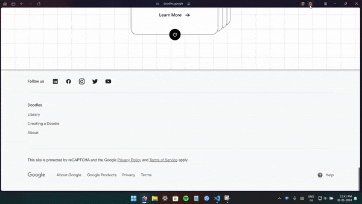
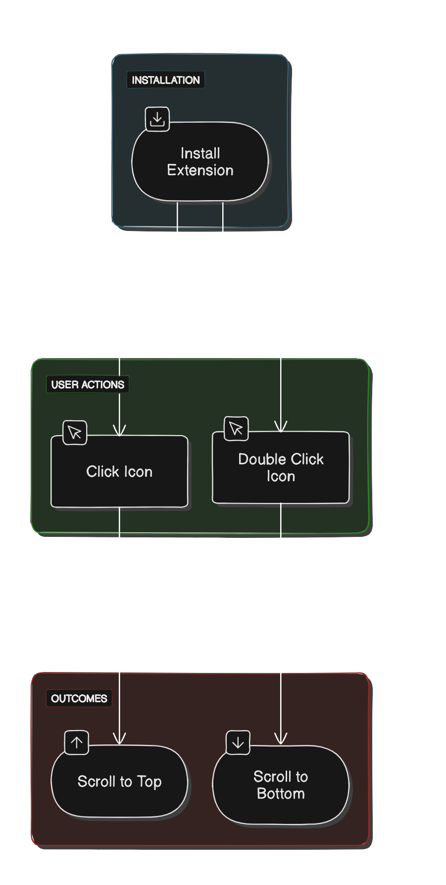

   
  <b>Quick Scroll</b>

Quick Scroll is a simple Chrome extension that allows you to quickly navigate to the top or bottom of a webpage with just a single click or double click. 

## Features

- **Single Click:** Scrolls to the top of the page.
- **Double Click:** Scrolls to the bottom of the page.

## Installation

### From the Chrome Web Store

1. Go to the [Quick Scroll extension page on the Chrome Web Store](#).
2. Click "Add to Chrome" to install the extension.

## Usage

1. Navigate to any webpage.
2. Scroll down the page.
3. Click the extension icon in the Chrome toolbar to scroll to the top.
4. Double click the extension icon to scroll to the bottom.

## Compatibility

- Quick Scroll is compatible with any Chromium-based browser, including Google Chrome, Microsoft Edge, Brave, and Opera.

## Demo

## License

This project is licensed under the MIT License - see the [LICENSE](LICENSE) file for details.

## Flowchart

